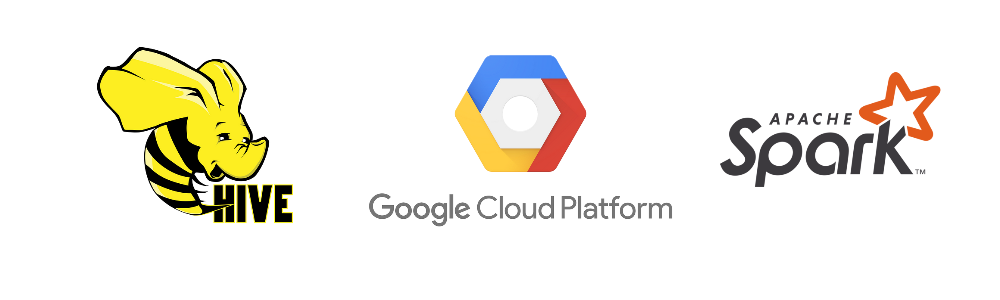

# 📌 Hive & PySpark SQL Analysis on Google Cloud Platform (GCP)
**Analyzing Retail Dataset Using Hive, PySpark, and SQLite on GCP**  

---

## 📖 Overview
This project focuses on **SQL-based big data analysis** using **Apache Hive and Apache Spark on Google Cloud Platform (GCP)** along with **SQLite**. The goal is to extract meaningful insights from a retail dataset by leveraging cloud computing and distributed data processing.

## 🔹 Technology Stack
- **Google Cloud Platform (GCP)** → Infrastructure for running Apache Hive and PySpark.
- **Apache Hive (Running on GCP Dataproc)** → Distributed SQL engine for large-scale queries.
- **Apache Spark (Running on GCP Dataproc)** → Fast, distributed data processing for complex analytics.
- **Google Cloud Storage (GCS)** → Cloud storage for structured and unstructured datasets.
- **SQLite (Local Processing)** → Lightweight SQL database for additional querying and analysis.

## 📂 Project Structure
<pre>
Hive-PySpark-SQL-Analysis/
│── dataset_link.txt            # dataset
│── queries/                    # SQL queries storage
│   ├── hive_queries.sql        # Hive SQL queries
│   ├── pyspark_queries.py      # PySpark SQL queries
│   ├── sqlite_queries.sql      # SQLite queries
│── screenshots/                # Screenshots of query results
│── README.md                   # Project documentation
│── QUESTIONS.md                # Query questions
│── requirements.txt            # Dependencies
│── .gitignore                  # Ignore unnecessary files
</pre>

## 📊 Key Analysis Areas
Queries analyze:
- **Aisle trends** → Identify best-selling aisles based on order volume.
- **Customer behavior** → Understanding purchasing patterns and repeat orders.
- **Product recommendations** → Frequently bought together products for cross-selling.
- **Time-based order patterns** → Identifying peak ordering hours for different departments.

---

## 🛠 How This Data Helps Retailers
✔ **Optimized product placement** based on aisle performance.  
✔ **Better customer experience** with relevant bundle offers.  
✔ **Data-driven marketing campaigns** for retargeting customers.  
✔ **Efficient staff & inventory management** based on time-based order trends.  

---

## 💡 Next Steps
🔹 **Run the SQL queries** inside the `queries/` folder.  
🔹 **View query results** in the `screenshots/` folder.  
🔹 **Extend the project** with **ML-based predictive analytics**.

---

## 📩 Contributions
If you have ideas for more queries, feel free to:
- Fork this repo & submit PRs.
- Open issues for discussions.

🚀 Let’s explore data-driven retail insights together!

---

## 📜 License
This project is licensed under **MIT License**.

---

## 🌟 Star This Repository
If you find this useful, consider giving it a ⭐ on GitHub!

